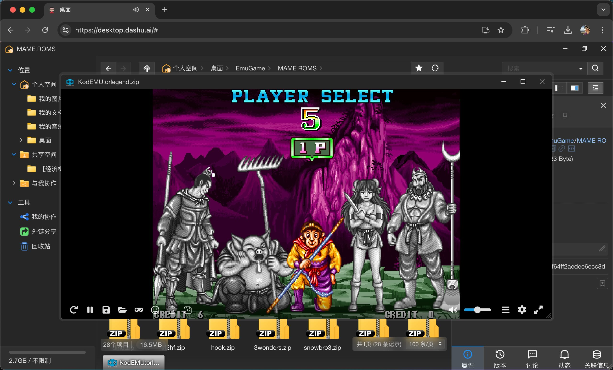
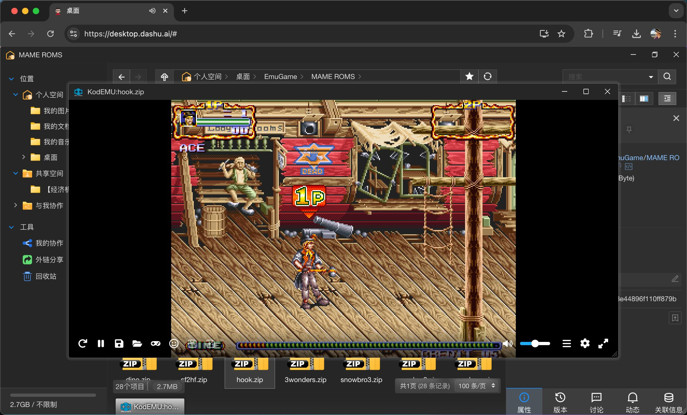

# KodEMU
在可道云KodBox上在线运行各种掌机街机游戏

> 插件使用 https://github.com/EmulatorJS/EmulatorJS 开源代码,支持在浏览器运行掌机街机游戏

### 关注作者

| Twitter | Youtube | Bilibili | Wechat | 
| - | - | - | - |
|  |  |  |  |

### 使用说明

请在KodBox中将此插件文件夹导入到KodBox根目录下的plugins文件夹。

在KodBox插件管理页面,启用插件（如果没有显示插件,请按Ctrl+F5刷新页面）

启用插件后，进入到KodBox文件管理页面,双击游戏rom文件开始游玩

enjoy！一起活到老，玩到死！